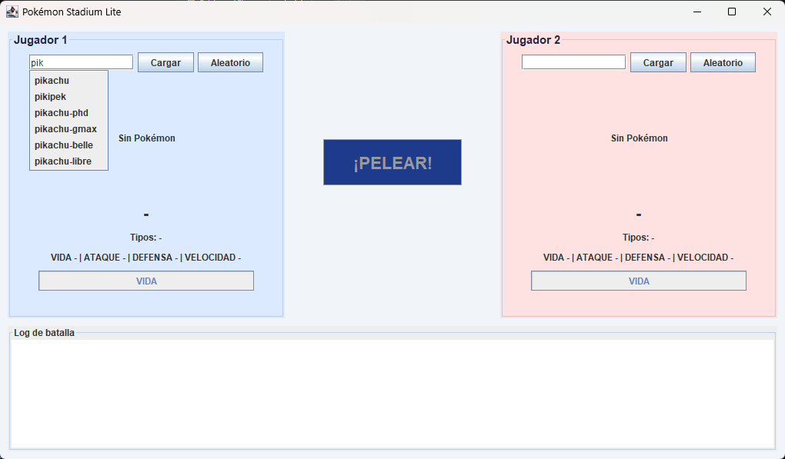
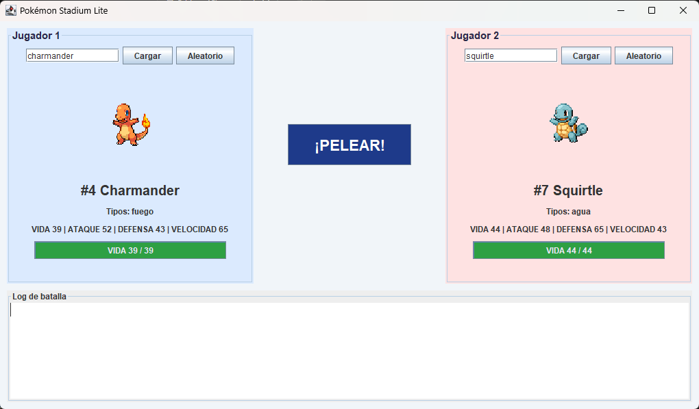
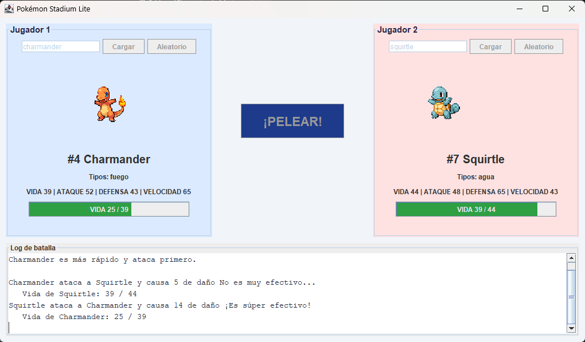
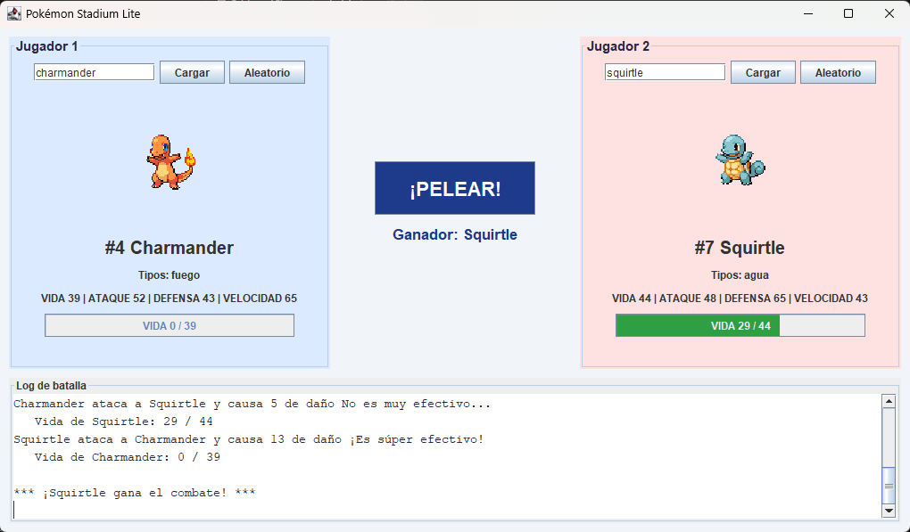

# Pokémon Stadium Lite

Juego de combate Pokémon en Java Swing que usa [PokeAPI](https://pokeapi.co/).

## Requisitos

- JDK 17 o más nuevo (el taller pide Java 11+)
- Conexión a internet (los Pokémon se descargan de PokeAPI)

## Cómo correrlo

Abrir la carpeta del proyecto en IntelliJ y ejecutar `src/pokemon/Main.java`.
La librería para leer JSON (org.json) ya viene incluida en `lib/json-20240303.jar`.

### Cómo se juega

1. En cada jugador escribe el nombre de un Pokémon (en inglés, ej. `pikachu`). Mientras escribes aparece
   una lista corta con los nombres que empiezan igual; haz clic en uno para cargarlo, o presiona **Cargar**.
   También puedes presionar **Aleatorio** para que salga uno al azar.
2. Cuando los dos Pokémon estén cargados se habilita **¡PELEAR!**.
3. Durante el combate el que ataca se lanza hacia el rival, las barras de vida bajan
   y el log cuenta todo lo que pasa. Al final se anuncia el ganador.

## Estructura

```
src/pokemon/
├── Main.java                  punto de entrada
├── api/                       cliente HTTP de PokeAPI
├── combate/                   reglas del combate (Battle) y su listener
├── interfaz/                  ventana y paneles Swing
└── modelo/                    clase Pokemon
```

## Explicación del diseño

El programa está dividido en capas, y cada clase hace UNA sola cosa. `PokeApiClient` es la única que
habla con internet: hace la petición HTTP con `HttpClient` (igual que en clase) y convierte el JSON en
un objeto `Pokemon`, que solo guarda datos (nombre, tipos, stats, imagen y vida actual). `Battle` tiene
las reglas del combate (quién ataca primero, cuánto daño se hace, cuándo termina) pero no dibuja nada:
cuando pasa algo, se lo avisa a un `BattleListener` (una interface con `onTurn`, `onHpChanged` y
`onBattleEnded`). La ventana (`VentanaCombate`) implementa ese listener, y por eso la pantalla se
actualiza solo a partir de esos eventos, como pide el taller. Así se podría cambiar la ventana sin
tocar las reglas del combate.

Para que la ventana nunca se congele, lo que tarda se hace fuera del hilo de Swing: las peticiones a
internet usan un `SwingWorker` (en `PanelPokemon`) y el combate corre en un hilo aparte, porque tiene
pausas de 0,7 s entre turnos. Los avisos del combate llegan a la ventana por `SwingUtilities.invokeLater`,
que significa «hilo de Swing, dibuja esto tú». Los errores («Pokémon no encontrado», «error de red»)
se muestran en rojo y en una ventanita sin trabar nada.

### Fórmula de daño (la elegida y documentada)

```
daño = 10 * (ATAQUE del atacante / DEFENSA del defensor) * aleatorio(0.85 a 1.0)
          * efectividad * (1.5 si es crítico)
daño = mínimo 1 (así siempre hay daño y el combate termina)
```

Usamos la **proporción ataque / defensa** para que la defensa sí proteja (si la defensa es el
doble del ataque, el golpe hace la mitad), y un azar pequeño (85 % a 100 %) para que las
estadísticas decidan la pelea y no la suerte. Descartamos la fórmula de ejemplo
(`ATK*random - DEF*random`) porque en Charmander vs Squirtle un solo golpe podía quitar
de 3 a 62 de vida, y el resultado era casi pura suerte.

- Crítico: 10 % de probabilidad, multiplica por 1.5.
- Efectividad (solo el primer tipo): Agua > Fuego, Fuego > Planta, Planta > Agua = x1.3;
  al revés = x0.7; el resto = x1.0.
- Ataca primero el de mayor velocidad; si empatan, se sortea. El HP nunca baja de 0.

## Capturas de pantalla

**1. Sugerencias mientras se escribe** (al escribir «pik» aparece una lista corta)



**2. Los dos Pokémon cargados** (¡PELEAR! habilitado)



**3. El Jugador 2 se lanza a atacar** (el Pokémon se acerca al rival)



**4. Ganador anunciado**


